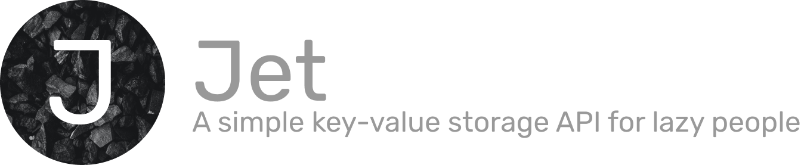

<div align="center">

# 

[](https://github.com/go-gems/Jet/actions/workflows/go.yml)
[](https://coveralls.io/github/go-gems/Jet?branch=master)
</div>

Jet is a deadly-simple key-value api. The main goals of this project are :

- Making a simple KV tool for our [other projects](https://github.com/go-gems).
- Learn tests writing and github actions.

## Getting started

In order to use the project, the most simple way is to use the already built image.

Just run the following command to get started:

```shell
docker run -p 8000:8000 gogems/jet
```

It will start and expose the jet api on your port 8000.


A more complete example : 
```shell
docker run -p 8080:8080 -v /var/logs:/storage gogems/jet \
  -port 8080 \
  -storage.dir /storage \
  -generator.short 5
```
Will expose port 8080, and use /storage from the container as storage directory which will be mapped to /var/jet-storage folder. It will also use the short generator.

## Api

The api exposes the following routes:

### GET /

Returns an array of available keys, json format.

### GET /{key}

Return the content stored for `{key}`.

### POST /
Accept any content-type, and store it to a generated key. Returns the key.

### PUT /{key}
Create or override the value for `{key}`. Returns the key.

### DELETE /{key}
Deletes the value for `{key}`.

## Storage

There are currently 2 types of storage engine, but feel free to add yours.

### In Memory Storage (default)

By default, it will use the **not** persistent storage `inMemory`.

### File Storage

You can use file storage which will basically store the file named like the key you have specified.

To use it, just specify on start the flag :

```
-storage.dir path/to/store
```

For docker for example with shared volume :

```
docker run -p 8000:8000 -v $PWD/storage:/storage gogems/jet -storage.dir /storage
```

### Your Storage

If you want to add a storage, feel free to contribute. Just implement the `Storage` interface

```go
type Storage interface {
Store(id string, content []byte) error
FetchOne(id string) ([]byte, error)
FetchAll() (map[string][]byte, error)
Delete(id string) error
KeyExists(id string) (bool, error)
}
```

## Key Generation

There are currently 3 types of automated Key generations.

### UuidGenerator (default)

By default, the key will be a UUID based on [RFC 4122](https://tools.ietf.org/html/rfc4122).

### incrementalGenerator

The next integer available key starting at 1.

On start, it will begin at 1 and when a cell is available it will fill it. It won't start again unless you restart the
program. This may lead to unexpected side effects for your and you should never rely on the id to get the size of the
collection.

``` 
example of side effects : 

let's say you have the following used keys : 
-> 1,2,3,5,6

On startup it will check until 4, and add something on 4.
-> 1,2,3,4,5,6

Then you delete 2.
-> 1,3,4,5,6

On next value adding, it will start from 5 and add it to 7.
-> 1,3,4,5,6,7

If you restart it, assuming you have persistent storage, on next storage, it will be on 2.
-> 1,2,3,4,5,6,7
```

To use it, just specify on start the flag :

```
-generator.inc
```

For docker for example with shared volume :

```
docker run -p 8000:8000 gogems/jet -generator.inc
```

**So please, be careful about using this generator on production**

### ShortGenerator

The short generator is a 63 characters (a-z, A-Z, 0-9 and -) based string clever generator which aims to generates
shortest keys. The generator expects a "minimum character number" and will generate a string. If it collides, it will
increase the current generation by one until it doesn't collides.

```
For example, let's start at 3 size char.

It will generate, "AxF"
If it collides on second time, it will generate "0HTe"
On third time, if it doesn't collides, it will generate "RRu"
On fourth time, if it collides at 3 chars, it will check at 4, and if it collides it will generate a 5 char id
And back to 3.
```

It's not a conventional way to generate keys, but I like the naive approach.

To use it, just specify on start the flag :

```
-generator.short MINIMUM_NUMBER
```

where MINIMUM_NUMBER is the starting number of characters in generation trial.

For docker for example with shared volume :

```
docker run -p 8000:8000 gogems/jet -generator.short 17
```

### Your generator

Feel free to contribute by adding your generator. You just need to implement the `KeyGeneratorInterface`

```go
type KeyGenerator interface {
GetRandomKey(storage StorageEngines.Storage) string
}
```

## Configuration
If you want to change the Host or Port you can use the respective -host and -port. default to 127.0.0.1 and 8000.

## Credits

Photo by <a href="https://unsplash.com/@nicknice?utm_source=unsplash&utm_medium=referral&utm_content=creditCopyText">
Nick Nice</a>
on <a href="https://unsplash.com/s/photos/black-stone?utm_source=unsplash&utm_medium=referral&utm_content=creditCopyText">
Unsplash</a>
  
